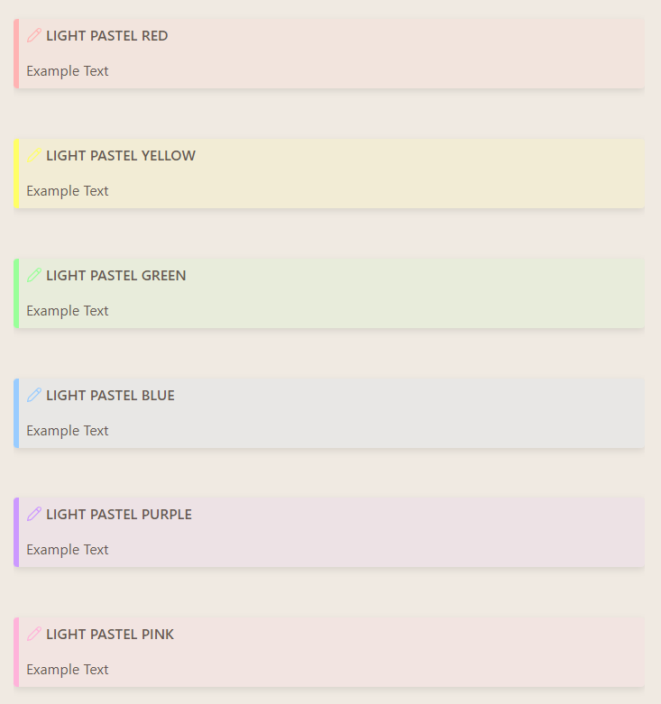
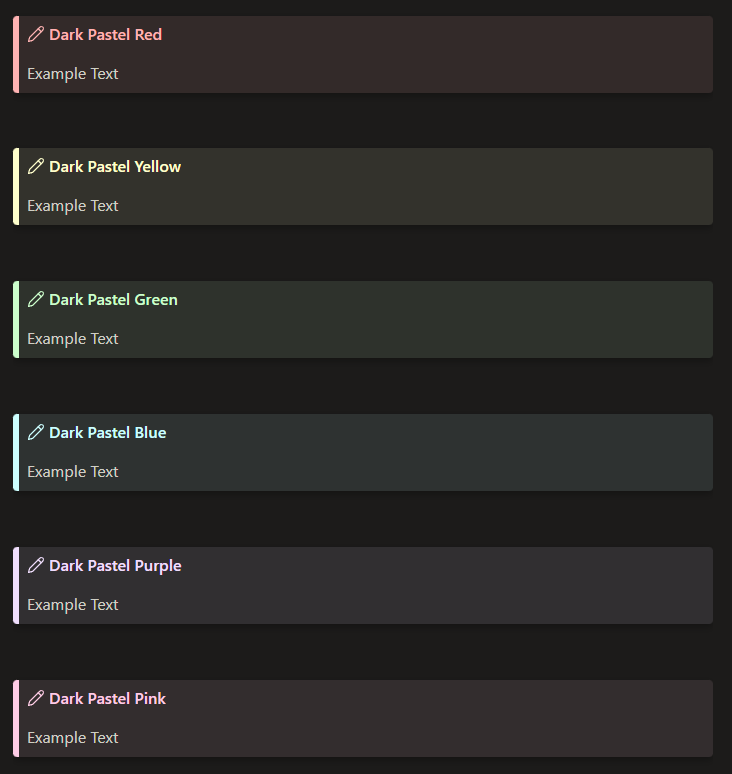

# How to install 

- Download the .css file
- Open the Obsidian Vault folder in which you want to use this
- Open the `.obsidian` folder
- Open the `snippets` folder and paste the file in there. If you don't have a `snippets` folder, create it.
- Once done, go to Setting -> Appearance and scroll down (If you can't see it, close and reopen Obsidian)
- Toggle `pastel-callouts` on

# What it looks like 
## For Light Themes 


## For Dark Themes


# How to use
Create a normal callout like you would usually do, and type the color you want (list below) after the type Identifier (like "NOTE") so it would look like this for example: 
```
> [!NOTE|dpred] Dark Pastel Red
> Example Text
```

## For Light Themes
- Red = `lpred`
- Yellow = `lpyellow`
- Green = `lpgreen`
- Blue = `lpblue`
- Purple = `lppurple`
- Pink = `lppink`

## For Dark Themes
- Red = `dpred`
- Yellow = `dpyellow`
- Green = `dpgreen`
- Blue = `dpblue`
- Purple = `dppurple`
- Pink = `dppink`
